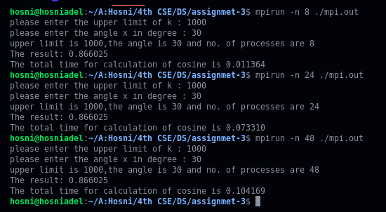
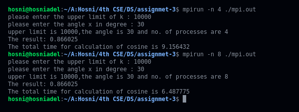
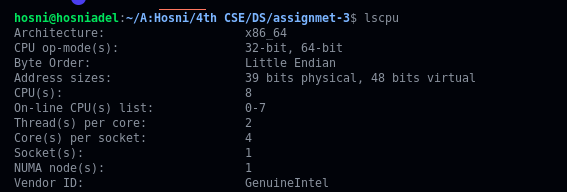
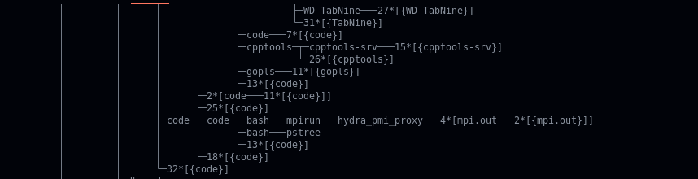
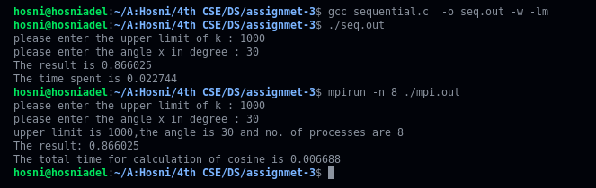
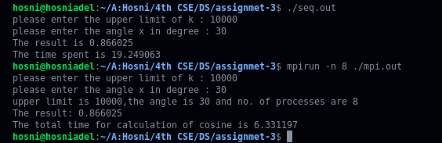

# Table of contents

- [Problem Statement](#problem-statement)
- [Dependencies](#dependencies)
- [Running the code](#running-the-code)
- [Demo](#demo)

# Problem Statement
- [download](https://lms.eng.asu.edu.eg/pluginfile.php/436262/mod_assign/introattachment/0/Assignment3.pdf?forcedownload=1)
# Dependencies

<b>1- Installing mpich2 (Ubuntu 20.04): </b>

- The tar file mpich-4.0b1.tar.gz which can be obtained from [mpich2](http://www-unix.mcs.anl.gov/mpi/mpich2/).

- Create a divectory MPI in the home divectory:

  ```
  cd $HOME

  mkdir MPI
  ```

- Unpack the tar file inside MPI divectory:
  ```
  tar xfz mpich-4.0b1.tar.gz
  ```
- Choose an installation divectory:

  ```
  mkdir mpich-install
  ```

- Choose a build divectory:

  ```
  mkdir mpich-build
  ```

- Configure MPICH2, specifying the installation divectory and running the configure script in the source divectory:

  ```
  cd $HOME

  cd MPI/mpich-build

  /home/<user>/MPI/mpich-4.0b1/configure -prefix=/home/<you>/MPI/mpich-install
  ```

- Build MPICH2:
  ```
  make
  ```
- Install the MPICH2 commands:
  ```
  make install
  ```
- Add the bin divectory to your path:

  ```
  export PATH=/home/<user>/MPI/mpich-install/bin:$PATH
  ```

  or It is better to append this line in .bachrc file present in the home divectory so that this path gets permanently added once we reboot the system:

  ```
  cd $HOME

  nano .bachrc
  ```

- Verifying MPICH2 Installation by:

  ```
  mpicc --version
  ```

  The output should be something like this:

  > gcc (Ubuntu 9.3.0-17ubuntu1~20.04) 9.3.0

    <!-------------------------------------------------------------------------------------------------->
  <br>

# Running the code

<b>1- Using MPI parallelization: </b>

- Build the code:
  ```
  mpicc main.c -o mpi.out -lm -w
  ```
- Run the code:
  ```
  mpirun -n [processes number] [excutable]
  ```
  For example:
  ```
  mpirun -n 10 ./mpi.out
  ```
<b>2- Using the sequential version: </b>
- Compile the code:
  ```
  mpicc squential.c -o seq.out -lm -w
  ```
- Run the code:
  ```
  ./seq.out
  ```

# Demo

<br>
<p align="center">
  
  <div align="center">- Run 8, 24, 48 processes to compute the series with upper limit 1000</div>
</p>
<br>

|                                                               |                                                     |
| :-----------------------------------------------------------: | :-------------------------------------------------: |
| - 8 processes is faster than 4 process | - As shown there are 8 cores |

<br>
<p align="center">
  
  <div align="center">- Run pstree to show the running processes</div>
</p>

|                                          |                                          |
| :--------------------------------------: | :--------------------------------------: |
|  Upper limit 1000 | Upper limit 10000 |

  <div align="center">- This example shows that the MPI version is about three times faster than sequential version</div>
